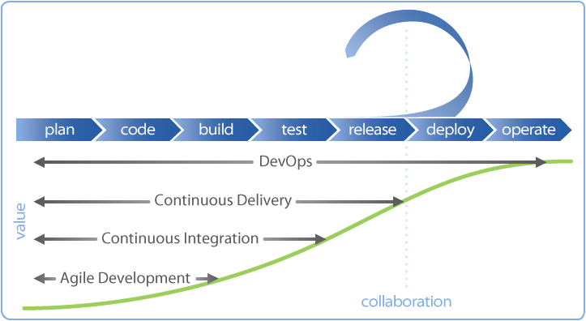

基礎介紹
========

軟體開發團隊實踐敏捷流程的忠實管家－Jenkins，非常值得您的信賴，因為只要交代給他任務，再瑣碎繁雜的事情，他也會二十四小時替您達成使命。

Jenkins 的前身是 Hudson 專案，它的功能類似 CruiseControl 或其他開放源碼的建構伺服器，愈來愈多開發團隊選擇 Jenkins，相信它是更好的選擇。

Jenkins 是用 Java 開發的軟體，在 Java 開發社群也有比較高的知名度，但實際上絕大多數的專案，只要搭配合適的自動化建構與測試框架及工具，都能搭配 Jenkins 來實現「持續整合」與「持續交付」的敏捷流程。

請參考 CollabNet 的這張圖，從中可以看到專案每個階段應進行的任務：

Figure. Implement Continuous integration, Continuous Delivery and DevOps processes

資料來源：
http://www.collab.net/services/consulting

關於這些不同階段的任務，所要解決的事情說明如下：

1.	**Agile Development** 有效率地溝通、專注於達成價值最高的重要任務。
2.	**Continuous Integration** 自動化建置及測試，讓定義好的工作可以被重複自動執行。
3.	**Continuous Delivery** 讓自動化建置成功的專案，也可以自動發佈及部署，保持隨時有穩定版本可以在線運作，加速測試驗證功能的循環。
4.	**DevOps** 確保專案執行環境正常，負責將上述各項專案建置及維護，以及 Production 版本部署後的維護作業。

若想實踐敏捷開發流程，實際狀況絕非設立一個 DevOps 的專門職位，所有問題就能迎刃而解；實際上需要在專案從規劃、開發到部署的個階段，相關人員之間能夠緊密合作、審慎地思考如何做規劃，專案才可能順暢地進行。

事實上，前述述每個環節的最終目的，都是要避免所有不必要的浪費：

1. **Agile Development** 避免讓昂貴的人力（你）一直在做缺乏效率的溝通。
2. **Continuous Integration** 避免用昂貴的人力（你）進行重覆測試，避免用昂貴的人力（你）進行重覆專案的建置及測試。
3. **Continuous Delivery** 避免用昂貴的人力（你）重複處理 Production 版本部署的瑣碎細節。

除了解決不必要的浪費，還有避免人為導致的錯誤發生，當所有開發流程都能夠被自動化的程式替代，錯誤將會更容易被排除及驗證。

就像[豐田式生產][1]（TPS，亦稱 Lean Production）所提倡的理念：杜絕浪費；只要能夠不斷地減少時間和資源的浪費，就表示能有更多時間和資源，可以用來進行更有價值的事！

延伸閱讀：

* [企業端如何推動持續整合開發流程][2] goo.gl/iiCai7

  [1]: https://zh.wikipedia.org/wiki/%E8%B1%90%E7%94%B0%E7%94%9F%E7%94%A2%E6%96%B9%E5%BC%8F
  [2]: http://blog.trunk-studio.com/ci_impl/
